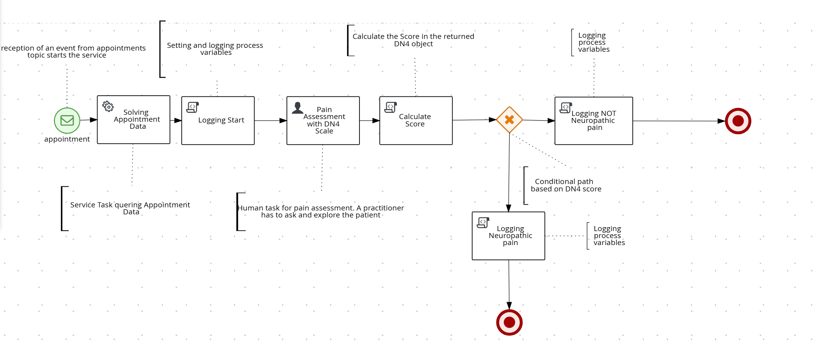

# 🏥 Servicio de Evaluación Neurológica

<p align="center">
  
</p>

Una aplicación Spring Boot con Kogito para orquestar evaluaciones de pacientes neurológicos mediante flujos de trabajo BPMN, integrándose con HAPI FHIR R5 y Apache Kafka para procesamiento basado en eventos.




## 📑 Tabla de Contenidos

- [📋 Descripción General del Proyecto](#descripción-general-del-proyecto)
- [🛠️ Pila Tecnológica](#pila-tecnológica)
- [🔌 Complementos de Kogito](#complementos-de-kogito)
- [⚙️ Funcionalidad](#funcionalidad)
- [🏗️ Arquitectura](#arquitectura)
- [📁 Estructura del Proyecto](#estructura-del-proyecto)
- [📖 Documentación del Proceso BPMN](#documentación-del-proceso-bpmn)
- [✅ Requisitos Previos](#requisitos-previos)
- [🚀 Compilar y Ejecutar](#compilar-y-ejecutar)
- [🖥️ Interfaces Disponibles](#interfaces-disponibles)
- [🔐 Configuración de Seguridad](#configuración-de-seguridad)
- [🌐 Endpoints de la API](#endpoints-de-la-api)

## 📋 Descripción General del Proyecto

Este proyecto es una aplicación **Spring Boot 2.7.18** que utiliza **Kogito 1.44.1.Final** para implementar la automatización de procesos de negocio para evaluaciones neurológicas. El servicio escucha eventos de citas desde Kafka, recupera información de pacientes y médicos de un servidor HAPI FHIR R5, y orquesta el flujo de trabajo de evaluación mediante procesos BPMN con tareas humanas.

### ✨ Características Clave

- 📨 **Arquitectura basada en eventos** con integración de Apache Kafka
- 🔄 **Orquestación de flujos de trabajo BPMN 2.0** usando Kogito
- 🏥 **Integración con FHIR R5** usando el cliente HAPI FHIR
- 👥 **Gestión de tareas humanas** con asignación basada en roles
- 📊 **Visualización de instancias de procesos** con generación de diagramas SVG
- 🌐 **API RESTful** para gestión de procesos y tareas
- 🔐 **Spring Security** con autenticación HTTP Basic

## 🛠️ Pila Tecnológica

| Tecnología | Versión | Propósito |
|------------|---------|-----------|
| ☕ Spring Boot | 2.7.18 | Framework de aplicación |
| 🔄 Kogito | 1.44.1.Final | Automatización de procesos de negocio |
| ☕ Java | 17 | Lenguaje de programación |
| 📨 Apache Kafka | 3.1.2 | Plataforma de streaming de eventos |
| 🏥 HAPI FHIR | 8.4.0 | Biblioteca cliente FHIR R5 |
| 📦 Jackson | 2.15.0 | Procesamiento JSON |
| 🔨 Maven | 3.x | Herramienta de construcción |

## 🔌 Complementos de Kogito

La aplicación incluye los siguientes complementos de Kogito:

### 🔄 Gestión de Procesos

- **`kogito-addons-springboot-process-management`**: Proporciona endpoints REST para gestionar instancias de procesos (iniciar, abortar, obtener estado)
- **`kogito-addons-springboot-process-svg`**: Genera diagramas SVG de instancias de procesos mostrando el estado actual y los nodos completados

### 👥 Gestión de Tareas

- **`kogito-addons-springboot-task-management`**: Expone API REST para operaciones de tareas humanas (reclamar, iniciar, completar, liberar)

### 📨 Eventos y Mensajería

- **`kogito-addons-springboot-events-process-kafka`**: Integra Kogito con Apache Kafka para consumir y producir CloudEvents
- **`kogito-addons-springboot-messaging`**: Habilita el activador de procesos basado en mensajes y la publicación de eventos

### ☁️ Soporte para CloudEvents

- **`cloudevents-json-jackson`**: Serialización/deserialización JSON de CloudEvents
- **`cloudevents-api`**: Implementación de la especificación CloudEvents

## ⚙️ Funcionalidad

### 🔄 Flujo del Proceso

1. **📩 Recepción de Eventos**: El servicio escucha el tema Kafka `appointments` para nuevos eventos de citas
2. **▶️ Inicio del Proceso**: Se crea una nueva instancia del proceso con los datos recuperados
3. **🏥 Integración con FHIR**: Al recibir una URL de cita, el servicio consulta el servidor HAPI FHIR para recuperar:
   - 👨‍⚕️ Información del médico (quién debe realizar la evaluación)
   - 🧑‍⚕️ Información del paciente (quién será evaluado)
4. **📋 Creación de Tarea Humana**: Se crea una tarea y se asigna al grupo `practitioner` para la evaluación del dolor DN4 (Douleur Neuropathique 4)
5. **✅ Finalización de la Tarea**: Un médico reclama y completa la tarea a través de la API REST o la interfaz web
6. **🏁 Finalización del Proceso**: El proceso finaliza después de registrar los resultados de la evaluación

### 🩺 Evaluación del Dolor DN4

El DN4 (Douleur Neuropathique 4 Questions) es una herramienta de detección para el dolor neuropático. La tarea requiere que los médicos evalúen a los pacientes basándose en:
- 🔥 Características del dolor (ardor, frío doloroso, descargas eléctricas)
- 🎯 Síntomas asociados (hormigueo, pinchazos, entumecimiento, picazón)
- 🔍 Hallazgos del examen (hipoestesia al tacto, hipoestesia al pinchazo, alodinia táctil)

## 🏗️ Arquitectura

### 📦 Arquitectura de Componentes

```
┌─────────────────────────────────────────────────────────────┐
│                    Aplicación Spring Boot                   │
├─────────────────────────────────────────────────────────────┤
│  ┌────────────────┐  ┌──────────────┐   ┌────────────────┐  │
│  │   Capa REST    │  │ Capa Web UI  │   │  Controladores │  │
│  │  (API Kogito)  │  │  (Estática)  │   │   (Personalizados) │  │
│  └────────┬───────┘  └──────┬───────┘   └────────┬───────┘  │
│           │                 │                    │          │
│  ┌────────┴─────────────────┴────────────────────┴───────┐  │
│  │              Motor de Procesos Kogito                 │  │
│  │  ┌──────────────┐  ┌────────────────────────────────┐ │  │
│  │  │ BPMN Process │  │  Gestión de Tareas Humanas     │ │  │
│  │  │   Runtime    │  │  (Work Items, Ciclo de vida)   │ │  │
│  │  └──────────────┘  └────────────────────────────────┘ │  │
│  └───────────────────────────────────────────────────────┘  │
│           │                                         │       │
│  ┌────────┴─────────┐                      ┌────────┴──────┐│
│  │  Lógica de       │                      │  Capa de      ││
│  │  Negocio         │                      │  Eventos      ││
│  │  (Servicios)     │                      │  (Kafka)      ││
│  └────────┬─────────┘                      └────────┬──────┘│
└───────────┼─────────────────────────────────────────┼───────┘
            │                                         │
    ┌───────┴─────────┐                       ┌───────┴────────┐
    │  HAPI FHIR R5   │                       │  Apache Kafka  │
    │   Servidor      │                       │   (localhost:  │
    │ (localhost:8888)│                       │     9092)      │
    └─────────────────┘                       └────────────────┘
```

### Arquitectura por Capas

1. **Capa de Presentación**
   - Páginas web estáticas (HTML/JS) para gestión de tareas y visualización de procesos (esta última característica está en desarrollo)
   - Controladores REST personalizados para generación SVG (en desarrollo) y operaciones de tareas
   - Endpoints REST autogenerados por Kogito

2. **Capa de Procesos**
   - Definiciones de procesos BPMN (`assessment.bpmn`)
   - Motor en tiempo de ejecución de Kogito para ejecución de procesos
   - Gestión del ciclo de vida de tareas humanas

3. **Capa de Lógica de Negocio**
   - `AppointmentDAOService`: Interfaz con el servidor HAPI FHIR
   - Clases de entidad: `DN4`, `AppointmentDTO`
   - Manejadores de tareas de servicio

4. **Capa de Integración**
   - Consumidor Kafka para eventos de citas
   - Cliente FHIR para recuperación de recursos
   - CloudEvents para publicación de eventos

5. **Capa de Seguridad**
   - Configuración de Spring Security
   - Autenticación de usuarios en memoria
   - Autorización basada en autoridades

## 📁 Estructura del Proyecto

```
kogitoNeurologicalAssessment/
├── 📂 src/
│   ├── 📂 main/
│   │   ├── ☕ java/us/dit/muit/hsa/neurologicalassessment/
│   │   │   ├── 🚀 NeurologicalAssessment.java          # Clase principal de la aplicación
│   │   │   ├── ⚙️ config/
│   │   │   │   └── 🔐 DefaultWebSecurityConfig.java    # Configuración de seguridad
│   │   │   ├── 🎮 controller/
│   │   │   │   ├── 📊 NeurologicalSvgController.java   # Endpoints SVG personalizados
│   │   │   │   └── 📋 NeurologicalTasksController.java # Endpoints de tareas personalizados
│   │   │   ├── 📦 entities/
│   │   │   │   ├── 📄 AppointmentDTO.java              # Objeto de transferencia de datos de citas
│   │   │   │   └── 🩺 DN4.java                         # Entidad de evaluación DN4
│   │   │   └── 🔧 services/
│   │   │       └── 🏥 AppointmentDAOService.java       # Servicio de integración con FHIR
│   │   └── 📂 resources/
│   │       ├── ⚙️ application.properties                # Configuración de la aplicación
│   │       ├── 🔄 assessment.bpmn                       # Definición del proceso BPMN
│   │       ├── 📂 META-INF/
│   │       │   └── 🔧 kmodule.xml                       # Configuración del módulo Kogito
│   │       └── 🌐 static/                               # Recursos de la interfaz web
│   │           ├── 🏠 index.html                        # Página de inicio
│   │           ├── 📋 task-list.html                    # Interfaz de lista de tareas
│   │           ├── ✅ task-form.html                    # Formulario de finalización de tareas
│   │           ├── 📊 process-diagram.html              # Visor de definición de procesos
│   │           └── 👁️ process-instances-viewer.html     # Visor de estado de instancias
│   └── 🧪 test/
│       └── 📂 resources/                                # Scripts de prueba (PowerShell)
├── 📂 resources/
│   ├── 📚 docs/                                         # Documentación adicional
│   │   ├── 🖼️ img/                                      # Imágenes de la documentación
│   │   │   ├── 🛠️ frameworks.png                        # Imagen de pila tecnológica
│   │   │   └── 🧠 bpmn.png                              # Imagen del diagrama de proceso
│   │   ├── 📖 PROCESS_ANNOTATIONS.md                    # Documentación detallada de elementos BPMN
│   │   └── 📄 TASK_API_USAGE.md                         # Guía de uso de la API de tareas
├── 🔨 pom.xml                                           # Configuración del proyecto Maven
└── 📖 README.md                                         # Archivo README en inglés
```

## 📖 Documentación del Proceso BPMN

El flujo de trabajo de evaluación neurológica está definido en `src/main/resources/assessment.bpmn`. Para una **explicación detallada de cada elemento del proceso** (eventos de inicio, tareas, compuertas, eventos de fin), incluidos su propósito, entradas, salidas y código, por favor consulte:

📖 **[PROCESS_ANNOTATIONS.md](resources/docs/PROCESS_ANNOTATIONS.md)**

Este documento proporciona:
- Anotaciones detalladas para cada elemento BPMN
- Explicación de la escala de evaluación del dolor DN4
- Lógica del flujo del proceso y puntos de decisión
- Variables del proceso y su uso
- Instrucciones de prueba y puntos de integración

### Descripción Rápida del Proceso

1. **▶️ Evento de Inicio** - Recibe mensaje de cita desde Kafka
2. **🔧 Tarea de Servicio** - Recupera datos de la cita del servidor FHIR
3. **📝 Tarea de Script** - Registra y establece variables del proceso
4. **👨‍⚕️ Tarea de Usuario** - El médico realiza la evaluación del dolor DN4
5. **🧮 Tarea de Script** - Calcula la puntuación DN4
6. **🔀 Compuerta** - Decide basándose en la puntuación (umbral: 4 puntos)
7. **📊 Tarea de Script** - Registra el resultado del diagnóstico (neuropático o no)
8. **🏁 Evento de Fin** - El proceso termina

## ✅ Requisitos Previos

### 📋 Software Requerido

1. **☕ Kit de Desarrollo Java (JDK) 17**
   ```bash
   java -version  # Debería mostrar versión 17.x
   ```

2. **🔨 Apache Maven 3.x**
   ```bash
   mvn -version
   ```

3. **📨 Apache Kafka**
   - Inicia un contenedor docker usando
   ```bash
   docker run -p 9092:9092 --name kafka apache/kafka:4.1.0
   ``` 
   - Conecta un terminal al contenedor y muévete a la carpeta bin
   ```bash
     docker exec -it kafka /bin/bash
     cd opt/kafka/bin/
     ```
   - Inicia un productor para el tema appointments. ¡No cierres el terminal!
     ```bash
     ./kafka-console-producer.sh --bootstrap-server localhost:9092 --topic appointments
     ```

4. **🏥 Servidor HAPI FHIR R5**
   - Puedes usar el servidor hapi fhir en línea, o seguir estas instrucciones para iniciar tu propio servidor
   - Inicia un servidor FHIR R5 usando la imagen oficial. Muévete a la carpeta "resources" y ejecuta
   ```bash
    docker run -p 8090:8080 -v $(pwd)/hapi-data:/configs -e "--spring.config.location=file:///configs/application.yaml" hapiproject/hapi:latest
    ```
   - Después de esto, debería estar ejecutándose un servidor FHIR R5 en `http://localhost:8888/fhir`
   - Crea los recursos necesarios (puedes usar el `bundle.json` disponible en `resources/FHIRResources` dentro de una transacción):
     - 📅 Recursos de Appointment
     - 🧑‍⚕️ Recursos de Patient
     - 👨‍⚕️ Recursos de Practitioner

### ⚙️ Configuración

Configuración predeterminada en `application.properties`

## 🚀 Compilar y Ejecutar

### 🔨 Compilar el Proyecto

```bash
# Limpiar y compilar
mvn clean compile

# El plugin Maven de Kogito generará el código del proceso durante la compilación
```

### ▶️ Ejecutar la Aplicación

```bash
# Opción 1: Usando Maven
mvn spring-boot:run

# Opción 2: Usando JAR
mvn clean package
java -jar target/neurological-assessment-1.0.0-SNAPSHOT.jar
```

## 🖥️ Interfaces Disponibles

### 🌐 Interfaces Web

Todas las interfaces web requieren autenticación (usa `doctorWho:doctorWho`).

| URL | Descripción | Propósito |
|-----|-------------|-----------|
| 🏠 `http://localhost:8080/` | **Página de Inicio** | Punto de entrada principal con enlaces a todas las interfaces |
| 📋 `http://localhost:8080/task-list.html` | **Lista de Tareas** | Ver y gestionar tareas humanas disponibles |
| ✅ `http://localhost:8080/task-form.html` | **Formulario de Tareas** | Completar tareas de evaluación DN4 |
| 📚 `http://localhost:8080/swagger-ui/index.html` | **Interfaz Swagger** | Detalle de la API REST a través de swagger (open-api) |

### 🌐 Endpoints de la API REST

#### 🤖 Endpoints Autogenerados de Kogito

##### 🔄 Gestión de Procesos

```bash
# Listar todas las instancias de procesos
GET /assessment

# Obtener instancia de proceso específica
GET /assessment/{instanceId}

# Iniciar nueva instancia de proceso (usualmente activado por Kafka)
POST /assessment

# Abortar instancia de proceso
DELETE /assessment/{instanceId}
```

##### 📋 Gestión de Tareas (Autogeneradas)

```bash
# Listar todas las tareas de una instancia de proceso
GET /assessment/{instanceId}/tasks

# Obtener tarea específica
GET /assessment/{instanceId}/painAssessment/{taskId}

# Reclamar una tarea
POST /assessment/{instanceId}/painAssessment/{taskId}?phase=claim&user={username}

# Iniciar una tarea (después de reclamar)
POST /assessment/{instanceId}/painAssessment/{taskId}?phase=start&user={username}

# Completar una tarea con datos
POST /assessment/{instanceId}/painAssessment/{taskId}?phase=complete&user={username}
Content-Type: application/json

{
  "dn4": {
    "burningPain": true,
    "painfulCold": false,
    "electricShocks": true,
    "tingling": true,
    "pinsAndNeedles": false,
    "numbness": false,
    "itching": false,
    "hypoesthesiaTouch": true,
    "hypoesthesiaPinprick": false,
    "brushingAllodynia": false
  }
}

# Liberar una tarea reclamada
POST /assessment/{instanceId}/painAssessment/{taskId}?phase=release&user={username}
```

#### Endpoints Personalizados

##### Gestión de Tareas (Controlador Personalizado)
```bash
# Listar todas las tareas de todas las instancias de procesos (agrupadas por usuario)
GET /neurological/tasks

# Obtener información detallada de la tarea
GET /neurological/tasks/{processInstanceId}/{taskId}

# Completar tarea con transición a la siguiente fase
POST /neurological/tasks/{processInstanceId}/{taskId}/complete
Content-Type: application/json

{
  "dn4": { ... }
}
```
### Ejemplo: Flujo de Trabajo Completo vía API

```bash
# 1. Activar proceso enviando mensaje Kafka
kafka-console-producer --broker-list localhost:9092 --topic appointments
> {"appointmentURL": "http://localhost:8888/fhir/Appointment/123"}

# 2. Listar instancias de procesos para obtener instanceId
curl -u doctorWho:doctorWho http://localhost:8080/assessment

# 3. Listar tareas de la instancia
curl -u doctorWho:doctorWho http://localhost:8080/neurological/tasks

# 4. Ver estado de la instancia como SVG
curl -u doctorWho:doctorWho http://localhost:8080/svg/neurologicalassessment.assessment/{instanceId} > instance.svg

# 5. Reclamar e iniciar tarea
curl -X POST -u doctorWho:doctorWho \
  "http://localhost:8080/assessment/{instanceId}/painAssessment/{taskId}?phase=claim&user=doctorWho"

curl -X POST -u doctorWho:doctorWho \
  "http://localhost:8080/assessment/{instanceId}/painAssessment/{taskId}?phase=start&user=doctorWho"

# 6. Completar tarea con datos DN4
curl -X POST -u doctorWho:doctorWho \
  -H "Content-Type: application/json" \
  -d '{"dn4": {"burningPain": true, "electricShocks": true, "tingling": true, "hypoesthesiaTouch": true, "painfulCold": false, "pinsAndNeedles": false, "numbness": false, "itching": false, "hypoesthesiaPinprick": false, "brushingAllodynia": false}}' \
  "http://localhost:8080/assessment/{instanceId}/painAssessment/{taskId}?phase=complete&user=doctorWho"
```

## 🔐 Configuración de Seguridad

### 👥 Credenciales de Usuario

La aplicación utiliza autenticación en memoria con los siguientes usuarios predefinidos:

| Nombre de usuario | Contraseña | Autoridad | Descripción |
|----------|----------|-----------|-------------|
| 👨‍⚕️ `doctorWho` | `doctorWho` | `practitioner` | Médico - puede completar evaluaciones |
| 👨‍⚕️ `paul` | `paul` | `practitioner` | Médico - puede completar evaluaciones |
| 🧑‍⚕️ `mary` | `mary` | `patient` | Rol de paciente - acceso de solo lectura |

### ⚠️ Notas Importantes

- Los usuarios se configuran con `.authorities()` en lugar de `.roles()` para coincidir con el `GroupId` de BPMN sin el prefijo `ROLE_`
- Todos los endpoints REST requieren autenticación HTTP Basic
- Las tareas asignadas al grupo `practitioner` solo pueden ser completadas por usuarios con autoridad `practitioner`
- Para uso en producción, reemplace la autenticación en memoria con un sistema de gestión de usuarios apropiado (LDAP, OAuth2, etc.)

### Personalizar la Seguridad

Para agregar más usuarios, modifica `DefaultWebSecurityConfig.java`:

```java
@Bean
public UserDetailsService userDetailsService() {
    InMemoryUserDetailsManager manager = new InMemoryUserDetailsManager();
    
    manager.createUser(User.withUsername("nuevoUsuario")
        .password(passwordEncoder().encode("contraseña"))
        .authorities("practitioner")  // Nota: usa authorities, no roles
        .build());
    
    return manager;
}
```

## Documentación Adicional

- **[TASK_API_USAGE.md](resources/docs/TASK_API_USAGE.md)**: Guía detallada sobre el uso de la API de tareas y su ciclo de vida


## Contribuciones

Este proyecto está destinado a propósitos educativos. Para preguntas o problemas:

1. Consulta la documentación existente en la carpeta `resources/docs/`
2. Revisa la definición del proceso BPMN en `src/main/resources/assessment.bpmn`
3. Examina los fuentes generados en `target/generated-sources/kogito/` después de la compilación

## Licencia

Este proyecto se proporciona tal cual para propósitos educativos. Por favor, consulta con el mantenedor del proyecto para detalles de licencia.

---

**Construido con ❤️ para estudiantes de HSA, MUIT-US, usando Kogito, Spring Boot, Kafka y FHIR**
