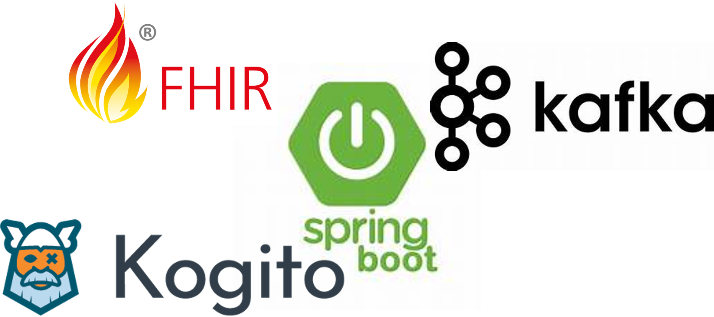

# 🏥 Neurological Assessment Service


A Spring Boot application with Kogito for orchestrating neurological patient assessments through BPMN workflows, integrating with HAPI FHIR R5 and Apache Kafka for event-driven processing.


## 📑 Table of Contents

- [📋 Project Overview](#project-overview)
- [🛠️ Technology Stack](#technology-stack)
- [🔌 Kogito Add-ons](#kogito-add-ons)
- [⚙️ Functionality](#functionality)
- [🏗️ Architecture](#architecture)
- [📁 Project Structure](#project-structure)
- [📖 BPMN Process Documentation](#bpmn-process-documentation)
- [✅ Prerequisites](#prerequisites)
- [🚀 Build and Run](#build-and-run)
- [🖥️ Available Interfaces](#available-interfaces)
- [🔐 Security Configuration](#security-configuration)
- [🌐 API Endpoints](#api-endpoints)

## 📋 Project Overview

This project is a **Spring Boot 2.7.18** application that uses **Kogito 1.44.1.Final** to implement business process automation for neurological assessments. The service listens to appointment events from Kafka, retrieves patient and practitioner information from a HAPI FHIR R5 server, and orchestrates the assessment workflow through BPMN processes with human tasks.

### ✨ Key Features

- 📨 **Event-driven architecture** with Apache Kafka integration
- 🔄 **BPMN 2.0 workflow** orchestration using Kogito
- 🏥 **FHIR R5 integration** with HAPI FHIR client
- 👥 **Human task management** with role-based assignment
- 📊 **Process instance visualization** with SVG diagram generation
- 🌐 **RESTful API** for process and task management
- 🔐 **Spring Security** with HTTP Basic authentication

## 🛠️ Technology Stack

| Technology | Version | Purpose |
|------------|---------|---------|
| ☕ Spring Boot | 2.7.18 | Application framework |
| 🔄 Kogito | 1.44.1.Final | Business process automation |
| ☕ Java | 17 | Programming language |
| 📨 Apache Kafka | 3.1.2 | Event streaming platform |
| 🏥 HAPI FHIR | 8.4.0 | FHIR R5 client library |
| 📦 Jackson | 2.15.0 | JSON processing |
| 🔨 Maven | 3.x | Build tool |

## 🔌 Kogito Add-ons

The application includes the following Kogito add-ons:

### 🔄 Process Management

- **`kogito-addons-springboot-process-management`**: Provides REST endpoints for managing process instances (start, abort, get status)
- **`kogito-addons-springboot-process-svg`**: Generates SVG diagrams of process instances showing current state and completed nodes

### 👥 Task Management

- **`kogito-addons-springboot-task-management`**: Exposes REST API for human task operations (claim, start, complete, release)

### 📨 Events & Messaging

- **`kogito-addons-springboot-events-process-kafka`**: Integrates Kogito with Apache Kafka for consuming and producing CloudEvents
- **`kogito-addons-springboot-messaging`**: Enables message-based process triggering and event publishing

### ☁️ CloudEvents Support

- **`cloudevents-json-jackson`**: CloudEvents JSON serialization/deserialization
- **`cloudevents-api`**: CloudEvents specification implementation

## ⚙️ Functionality

### 🔄 Process Flow

1. **📩 Event Reception**: The service listens to the `appointments` Kafka topic for new appointment events
2. **▶️ Process Initiation**: A new process instance is created with the retrieved data
3. **🏥 FHIR Integration**: Upon receiving an appointment URL, the service queries the HAPI FHIR server to retrieve:
   - 👨‍⚕️ Practitioner information (who should conduct the assessment)
   - 🧑‍⚕️ Patient information (who will be assessed)
4. **📋 Human Task Creation**: A task is created and assigned to the `practitioner` group for DN4 (Douleur Neuropathique 4) pain assessment
5. **✅ Task Completion**: A practitioner claims and completes the task through the REST API or web interface
6. **🏁 Process Completion**: The process finalizes after logging the assessment results

### 🩺 DN4 Pain Assessment

The DN4 (Douleur Neuropathique 4 Questions) is a screening tool for neuropathic pain. The task requires practitioners to evaluate patients based on:
- 🔥 Pain characteristics (burning, painful cold, electric shocks)
- 🎯 Associated symptoms (tingling, pins and needles, numbness, itching)
- 🔍 Examination findings (touch hypoesthesia, pinprick hypoesthesia, tactile allodynia)

## 🏗️ Architecture

### 📦 Component Architecture

```
┌─────────────────────────────────────────────────────────────┐
│                    Spring Boot Application                   │
├─────────────────────────────────────────────────────────────┤
│  ┌────────────────┐  ┌──────────────┐  ┌────────────────┐  │
│  │   REST Layer   │  │ Web UI Layer │  │  Controllers   │  │
│  │  (Kogito API)  │  │  (Static)    │  │   (Custom)     │  │
│  └────────┬───────┘  └──────┬───────┘  └────────┬───────┘  │
│           │                  │                    │           │
│  ┌────────┴──────────────────┴────────────────────┴───────┐ │
│  │              Kogito Process Engine                      │ │
│  │  ┌──────────────┐  ┌────────────────────────────────┐ │ │
│  │  │ BPMN Process │  │  Human Task Management         │ │ │
│  │  │   Runtime    │  │  (Work Items, Task Lifecycle)  │ │ │
│  │  └──────────────┘  └────────────────────────────────┘ │ │
│  └──────────────────────────────────────────────────────────┘ │
│           │                                          │         │
│  ┌────────┴─────────┐                      ┌────────┴──────┐ │
│  │  Business Logic  │                      │  Event Layer  │ │
│  │  (Services)      │                      │  (Kafka)      │ │
│  └────────┬─────────┘                      └────────┬──────┘ │
└───────────┼──────────────────────────────────────────┼────────┘
            │                                          │
    ┌───────┴─────────┐                       ┌────────┴────────┐
    │  HAPI FHIR R5   │                       │  Apache Kafka   │
    │     Server      │                       │   (localhost:   │
    │ (localhost:8888)│                       │     9092)       │
    └─────────────────┘                       └─────────────────┘
```

### Layered Architecture

1. **Presentation Layer**
   - Static web pages (HTML/JS) for task management and process visualization (this last feature is underdevelopment)
   - Custom REST controllers for SVG generation (under development) and task operations
   - Auto-generated Kogito REST endpoints

2. **Process Layer**
   - BPMN process definitions (`assessment.bpmn`)
   - Kogito runtime engine for process execution
   - Human task lifecycle management

3. **Business Logic Layer**
   - `AppointmentDAOService`: Interfaces with HAPI FHIR server
   - Entity classes: `DN4`, `AppointmentDTO`
   - Service task handlers

4. **Integration Layer**
   - Kafka consumer for appointment events
   - FHIR client for resource retrieval
   - CloudEvents for event publishing

5. **Security Layer**
   - Spring Security configuration
   - In-memory user authentication
   - Authority-based authorization

## 📁 Project Structure

```
kogitoNeurologicalAssessment/
├── 📂 src/
│   ├── 📂 main/
│   │   ├── ☕ java/us/dit/muit/hsa/neurologicalassessment/
│   │   │   ├── 🚀 NeurologicalAssessment.java          # Main application class
│   │   │   ├── ⚙️ config/
│   │   │   │   └── 🔐 DefaultWebSecurityConfig.java    # Security configuration
│   │   │   ├── 🎮 controller/
│   │   │   │   ├── 📊 NeurologicalSvgController.java   # Custom SVG endpoints
│   │   │   │   └── 📋 NeurologicalTasksController.java # Custom task endpoints
│   │   │   ├── 📦 entities/
│   │   │   │   ├── 📄 AppointmentDTO.java              # Appointment data transfer object
│   │   │   │   └── 🩺 DN4.java                         # DN4 assessment entity
│   │   │   └── 🔧 services/
│   │   │       └── 🏥 AppointmentDAOService.java       # FHIR integration service
│   │   └── 📂 resources/
│   │       ├── ⚙️ application.properties                # Application configuration
│   │       ├── 🔄 assessment.bpmn                       # BPMN process definition
│   │       ├── 📂 META-INF/
│   │       │   └── 🔧 kmodule.xml                       # Kogito module configuration
│   │       └── 🌐 static/                               # Web UI resources
│   │           ├── 🏠 index.html                        # Landing page
│   │           ├── 📋 task-list.html                    # Task list interface
│   │           ├── ✅ task-form.html                    # Task completion form
│   │           ├── 📊 process-diagram.html              # Process definition viewer
│   │           └── 👁️ process-instances-viewer.html     # Instance state viewer
│   └── 🧪 test/
│       └── 📂 resources/                                # Test scripts (PowerShell)
├── 📂 resources/
│   └── 🖼️ img/
│       ├── 📊 bpmn.png                                  # Process diagram image
│       └── 🛠️ frameworks.png                            # Technology stack image
├── 📚 docs/                                             # Additional documentation
├── 🔨 pom.xml                                           # Maven project configuration
└── 📖 README.md                                         # This file
```

## 📖 BPMN Process Documentation

The neurological assessment workflow is defined in `src/main/resources/assessment.bpmn`. For a **detailed explanation of each process element** (start events, tasks, gateways, end events), including their purpose, inputs, outputs, and code, please refer to:

📖 **[PROCESS_ANNOTATIONS.md](docs/PROCESS_ANNOTATIONS.md)**

This document provides:
- Detailed annotations for each BPMN element
- Explanation of the DN4 pain assessment scale
- Process flow logic and decision points
- Process variables and their usage
- Testing instructions and integration points

### Quick Process Overview

1. **▶️ Start Event** - Receives appointment message from Kafka
2. **🔧 Service Task** - Retrieves appointment data from FHIR server
3. **📝 Script Task** - Logs and sets process variables
4. **👨‍⚕️ User Task** - Practitioner performs DN4 pain assessment
5. **🧮 Script Task** - Calculates DN4 score
6. **🔀 Gateway** - Decides based on score (threshold: 4 points)
7. **📊 Script Task** - Logs diagnosis result (neuropathic or not)
8. **🏁 End Event** - Process terminates

## ✅ Prerequisites

### 📋 Required Software

1. **☕ Java Development Kit (JDK) 17**
   ```bash
   java -version  # Should show version 17.x
   ```

2. **🔨 Apache Maven 3.x**
   ```bash
   mvn -version
   ```

3. **📨 Apache Kafka**
   - Start a docker container using
   ```bash
   docker run -p 9092:9092 --name kafka apache/kafka:4.1.0
   ``` 
   - Connect a terminal to the container and move to the bin folder
   ```bash
     docker exec -it kafka /bin/bash
     cd opt/kafka/bin/
     ```
   - Start a producer for the topic apppointments. Don´t kill the terminal!!
     ```bash
     ./kafka-console-producer.sh --bootstrap-server localhost:9092 --topic appointments
     ```

4. **🏥 HAPI FHIR R5 Server**
   - You can use the online hapi fhir server, or follow these instructions to start your own server
   - Start a FHIR R5 server using the official image. Move to the "resources" folder and execute
   ```bash
    docker run -p 8090:8080 -v $(pwd)/hapi-data:/configs -e "--spring.config.location=file:///configs/application.yaml" hapiproject/hapi:latest
    ```
   - A FHIR R5 server should be running at `http://localhost:8888/fhir`
   - Create the needed resources (you can use the "bundle.json" available in resources/FHIRResources within a transaction):
     - 📅 Appointment resources
     - 🧑‍⚕️ Patient resources
     - 👨‍⚕️ Practitioner resources

### ⚙️ Configuration

Default configuration in `application.properties`

## 🚀 Build and Run

### 🔨 Compile the Project

```bash
# Clean and compile
mvn clean compile

# The Kogito Maven plugin will generate process code during compilation
```

### ▶️ Run the Application

```bash
# Option 1: Using Maven
mvn spring-boot:run

# Option 2: Using JAR
mvn clean package
java -jar target/neurological-assessment-1.0.0-SNAPSHOT.jar
```

## 🖥️ Available Interfaces

### 🌐 Web Interfaces

All web interfaces require authentication (use `doctorWho:doctorWho`).

| URL | Description | Purpose |
|-----|-------------|---------|
| 🏠 `http://localhost:8080/` | **Landing Page** | Main entry point with links to all interfaces |
| 📋 `http://localhost:8080/task-list.html` | **Task List** | View and manage available human tasks |
| ✅ `http://localhost:8080/task-form.html` | **Task Form** | Complete DN4 assessment tasks |
| 📚 `http://localhost:8080/swagger-ui/index.html` | **Swagger Interface** | Detail of REST API through swagger (open-api) |

### 🌐 REST API Endpoints

#### 🤖 Auto-generated Kogito Endpoints

##### 🔄 Process Management

```bash
# List all process instances
GET /assessment

# Get specific process instance
GET /assessment/{instanceId}

# Start new process instance (usually triggered by Kafka)
POST /assessment

# Abort process instance
DELETE /assessment/{instanceId}
```

##### 📋 Task Management (Auto-generated)

```bash
# List all tasks for a process instance
GET /assessment/{instanceId}/tasks

# Get specific task
GET /assessment/{instanceId}/painAssessment/{taskId}

# Claim a task
POST /assessment/{instanceId}/painAssessment/{taskId}?phase=claim&user={username}

# Start a task (after claiming)
POST /assessment/{instanceId}/painAssessment/{taskId}?phase=start&user={username}

# Complete a task with data
POST /assessment/{instanceId}/painAssessment/{taskId}?phase=complete&user={username}
Content-Type: application/json

{
  "dn4": {
    "burningPain": true,
    "painfulCold": false,
    "electricShocks": true,
    "tingling": true,
    "pinsAndNeedles": false,
    "numbness": false,
    "itching": false,
    "hypoesthesiaTouch": true,
    "hypoesthesiaPinprick": false,
    "brushingAllodynia": false
  }
}

# Release a claimed task
POST /assessment/{instanceId}/painAssessment/{taskId}?phase=release&user={username}
```

#### Custom Endpoints

##### Task Management (Custom Controller)
```bash
# List all tasks across all process instances (grouped by user)
GET /neurological/tasks

# Get detailed task information
GET /neurological/tasks/{processInstanceId}/{taskId}

# Complete task with transition to next phase
POST /neurological/tasks/{processInstanceId}/{taskId}/complete
Content-Type: application/json

{
  "dn4": { ... }
}
```
### Example: Complete Workflow via API

```bash
# 1. Trigger process by sending Kafka message
kafka-console-producer --broker-list localhost:9092 --topic appointments
> {"appointmentURL": "http://localhost:8888/fhir/Appointment/123"}

# 2. List process instances to get instanceId
curl -u doctorWho:doctorWho http://localhost:8080/assessment

# 3. List tasks for the instance
curl -u doctorWho:doctorWho http://localhost:8080/neurological/tasks

# 4. View instance state as SVG
curl -u doctorWho:doctorWho http://localhost:8080/svg/neurologicalassessment.assessment/{instanceId} > instance.svg

# 5. Claim and start task
curl -X POST -u doctorWho:doctorWho \
  "http://localhost:8080/assessment/{instanceId}/painAssessment/{taskId}?phase=claim&user=doctorWho"

curl -X POST -u doctorWho:doctorWho \
  "http://localhost:8080/assessment/{instanceId}/painAssessment/{taskId}?phase=start&user=doctorWho"

# 6. Complete task with DN4 data
curl -X POST -u doctorWho:doctorWho \
  -H "Content-Type: application/json" \
  -d '{"dn4": {"burningPain": true, "electricShocks": true, "tingling": true, "hypoesthesiaTouch": true, "painfulCold": false, "pinsAndNeedles": false, "numbness": false, "itching": false, "hypoesthesiaPinprick": false, "brushingAllodynia": false}}' \
  "http://localhost:8080/assessment/{instanceId}/painAssessment/{taskId}?phase=complete&user=doctorWho"
```

## 🔐 Security Configuration

### 👥 User Credentials

The application uses in-memory authentication with the following predefined users:

| Username | Password | Authority | Description |
|----------|----------|-----------|-------------|
| 👨‍⚕️ `doctorWho` | `doctorWho` | `practitioner` | Medical practitioner - can complete assessments |
| 👨‍⚕️ `paul` | `paul` | `practitioner` | Medical practitioner - can complete assessments |
| 🧑‍⚕️ `mary` | `mary` | `patient` | Patient role - read-only access |

### ⚠️ Important Notes

- Users are configured with `.authorities()` instead of `.roles()` to match BPMN `GroupId` without the `ROLE_` prefix
- All REST endpoints require HTTP Basic authentication
- Tasks assigned to `practitioner` group can only be completed by users with `practitioner` authority
- For production use, replace in-memory authentication with a proper user management system (LDAP, OAuth2, etc.)

### Customizing Security

To add more users modify `DefaultWebSecurityConfig.java`:

```java
@Bean
public UserDetailsService userDetailsService() {
    InMemoryUserDetailsManager manager = new InMemoryUserDetailsManager();
    
    manager.createUser(User.withUsername("newuser")
        .password(passwordEncoder().encode("password"))
        .authorities("practitioner")  // Note: use authorities, not roles
        .build());
    
    return manager;
}
```

## Additional Documentation

- **[TASK_API_USAGE.md](docs/TASK_API_USAGE.md)**: Detailed guide on task API usage and lifecycle
- **[TROUBLESHOOTING_TASKS.md](docs/TROUBLESHOOTING_TASKS.md)**: Common issues and solutions for task management

## Contributing

This project is intended for educational purposes. For questions or issues:

1. Check existing documentation in the `docs/` folder
2. Review the BPMN process definition in `src/main/resources/assessment.bpmn`
3. Examine generated sources in `target/generated-sources/kogito/` after compilation

## License

This project is provided as-is for educational purposes. Please check with the project maintainer for licensing details.

---

**Built with ❤️ using Kogito, Spring Boot, Kafka and FHIR**
