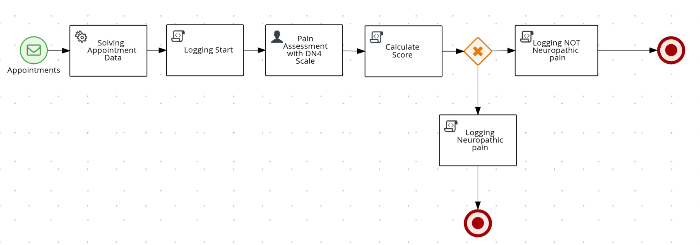

# Neurological Assessment Service

## Descripción

Servicio basado en Kogito y Spring Boot para gestionar evaluaciones neurológicas de pacientes. El servicio se integra con HAPI FHIR para obtener información de citas médicas (Appointments) y coordina el proceso de evaluación neurológica mediante tareas humanas y automatizadas.

## Características principales

* **Integración con Kafka**: Consume eventos de citas médicas desde un topic de Kafka (`appointments`)
* **Integración con HAPI FHIR R5**: Obtiene información de recursos FHIR Appointment desde un servidor FHIR externo
* **Proceso BPMN**: Orquesta el flujo de evaluación neurológica con tareas humanas y de servicio
* **Tareas humanas**: Permite a los practicantes (practitioners) realizar evaluaciones DN4 (Douleur Neuropathique 4)
* **Seguridad**: Implementa Spring Security con autenticación básica y control de acceso basado en roles
* **API REST**: Expone endpoints para gestionar instancias de proceso y tareas

## Flujo del proceso

1. El servicio escucha el topic `appointments` de Kafka
2. Al recibir un evento con una URL de Appointment FHIR, se inicia una nueva instancia del proceso
3. El servicio consulta el servidor HAPI FHIR para obtener los detalles de la cita (practitioner y patient)
4. Se crea una tarea humana asignada al grupo "practitioner" para realizar la evaluación DN4
5. El practicante completa la evaluación DN4 a través de la API REST
6. El proceso finaliza registrando la evaluación completada



## Usuarios y roles configurados

El servicio incluye una configuración de seguridad con los siguientes usuarios:

| Usuario    | Contraseña | Grupo/Autoridad | Descripción                                    |
|------------|------------|-----------------|------------------------------------------------|
| doctorWho  | doctorWho  | practitioner    | Practicante médico autorizado para evaluaciones|
| paul       | paul       | practitioner    | Practicante médico autorizado para evaluaciones|
| mary       | mary       | patient         | Paciente del sistema                           |

**Nota importante**: Los usuarios están configurados con `.authorities()` en lugar de `.roles()` para que coincidan con los `GroupId` del BPMN sin el prefijo `ROLE_`.

Para más detalles sobre el uso de la API de tareas, consulta [TASK_API_USAGE.md](docs/TASK_API_USAGE.md).

## Infraestructura requerida

### Apache Kafka

Este servicio requiere un servidor Apache Kafka disponible. Por defecto, espera que Kafka esté en `localhost:9092`.

* Instalar y arrancar Kafka Server / Zookeeper: <https://kafka.apache.org/quickstart>

### HAPI FHIR Server

El servicio se conecta a un servidor HAPI FHIR R5 para obtener información de recursos Appointment. Por defecto, está configurado para usar `https://hapi.fhir.org/baseR5/`.

Puedes cambiar la configuración en `application.properties`:

```properties
# Configuración de Kafka
spring.kafka.bootstrap-servers=localhost:9092
spring.kafka.consumer.group-id=appointments-group

# Topic de Kafka
kogito.addon.cloudevents.kafka.kogito_incoming_stream=appointments
```

## Compilar y ejecutar

### Prerequisitos

* Java 17+ instalado
* Variable de entorno JAVA_HOME configurada
* Maven 3.8.6+ instalado
* Apache Kafka en ejecución
* (Opcional) Servidor HAPI FHIR accesible

### Compilar y ejecutar en modo desarrollo

```sh
mvn clean compile spring-boot:run
```

### Empaquetar y ejecutar usando JAR

```sh
mvn clean package
```

Para ejecutar el JAR generado en `target/`:

```sh
java -jar target/neurological-assessment-1.0.0-SNAPSHOT.jar
```

## Documentación de la API

### OpenAPI (Swagger)

Puedes consultar la [definición OpenAPI](http://localhost:8080/v3/api-docs) generada automáticamente una vez que el servicio esté en ejecución. Para visualizarla de forma más legible, puedes usar [Swagger UI](https://editor.swagger.io).

### Endpoints principales

#### Gestión de Procesos
* `GET /assessment` - Listar instancias de proceso
* `POST /assessment` - Crear nueva instancia de proceso
* `GET /assessment/{processId}` - Obtener detalles de una instancia
* `DELETE /assessment/{processId}` - Cancelar instancia de proceso

#### Gestión de Tareas
* `GET /assessment/tasks` - Obtener todas las tareas del usuario autenticado
* `GET /assessment/{processId}/tasks` - Obtener tareas de una instancia específica
* `GET /assessment/{processId}/painAssessment/{taskId}` - Obtener detalles de una tarea
* `POST /assessment/{processId}/painAssessment/{taskId}` - Completar tarea de evaluación DN4

📖 **Documentación completa de la API de tareas**: Ver [TASK_API_USAGE.md](docs/TASK_API_USAGE.md)

## Uso del servicio

### 1. Iniciar el servicio

```sh
mvn spring-boot:run
```

### 2. Enviar un evento de Appointment a Kafka

En una terminal separada, inicia un consumidor para ver los eventos procesados:

```sh
bin/kafka-console-producer.sh --broker-list localhost:9092 --topic appointments
```

Envía un mensaje en formato CloudEvent con la URL de un Appointment FHIR:

```json
{
  "specversion": "1.0",
  "id": "21627e26-31eb-43e7-8343-92a696fd96b1",
  "source": "",
  "type": "appointments",
  "time": "2025-06-11T13:25:16Z",
  "data": "https://hapi.fhir.org/baseR5/Appointment/773551"
}
```

One-liner:

```json
{"specversion": "1.0","id": "21627e26-31eb-43e7-8343-92a696fd96b1","source": "","type": "appointments", "time": "2025-06-11T13:25:16Z","data": "https://hapi.fhir.org/baseR5/Appointment/773551"}
```

### 3. Consultar las tareas pendientes

**Opción 1: Todas las tareas del usuario autenticado** (recomendado)

```sh
curl -u doctorWho:doctorWho http://localhost:8080/assessment/tasks
```

**Opción 2: Listar instancias de proceso primero**

```sh
curl -u doctorWho:doctorWho http://localhost:8080/assessment
```

Luego obtén las tareas de una instancia específica:

```sh
curl -u doctorWho:doctorWho http://localhost:8080/assessment/{processId}/tasks
```

### 4. Completar una evaluación DN4

Completa la tarea de evaluación proporcionando los datos del cuestionario DN4:

```sh
curl -u doctorWho:doctorWho -X POST \
  http://localhost:8080/assessment/{processId}/painAssessment/{taskId} \
  -H 'Content-Type: application/json' \
  -d '{
    "dn4": {
      "burning": true,
      "painfulCold": false,
      "electricShocks": true,
      "tingling": true,
      "pinsPricks": false,
      "numbness": true,
      "itching": false,
      "hypoesthesiaTouch": true,
      "hypoesthesiaPinprick": false,
      "brushingAllodynia": true
    }
  }'
```

**En PowerShell:**

```powershell
$credentials = [Convert]::ToBase64String([Text.Encoding]::ASCII.GetBytes("doctorWho:doctorWho"))
$body = @{
    dn4 = @{
        burning = $true
        painfulCold = $false
        electricShocks = $true
        tingling = $true
        pinsPricks = $false
        numbness = $true
        itching = $false
        hypoesthesiaTouch = $true
        hypoesthesiaPinprick = $false
        brushingAllodynia = $true
    }
} | ConvertTo-Json

Invoke-RestMethod -Uri "http://localhost:8080/assessment/{processId}/painAssessment/{taskId}" `
  -Method POST `
  -Headers @{
      Authorization="Basic $credentials"
      "Content-Type"="application/json"
  } `
  -Body $body
```

## Estructura del proyecto

```text
.
├── src/main/java/us/dit/muit/hsa/neurologicalassessment/
│   ├── config/                          # Configuración de seguridad e identidad
│   │   ├── DefaultWebSecurityConfig.java
│   │   └── IdentityProviderConfig.java
│   ├── entities/                        # Modelos de datos
│   │   ├── AppointmentDTO.java
│   │   └── DN4.java
│   ├── services/                        # Servicios de negocio
│   │   └── AppointmentDAOService.java
│   └── NeurologicalAssessment.java      # Clase principal
├── src/main/resources/
│   ├── application.properties           # Configuración de la aplicación
│   └── assessment.bpmn                  # Definición del proceso BPMN
└── pom.xml                              # Dependencias Maven
```

## Tecnologías utilizadas

* **Kogito 1.44.1**: Framework de automatización de procesos
* **Spring Boot 2.7.18**: Framework de aplicación
* **Spring Security**: Autenticación y autorización
* **Spring Kafka**: Integración con Apache Kafka
* **HAPI FHIR 8.4.0**: Cliente FHIR para Java
* **Jackson 2.15.0**: Serialización/deserialización JSON

## Notas adicionales

* El servicio implementa un `IdentityProvider` personalizado para mapear correctamente los roles de Spring Security a grupos de Kogito
* Las tareas están asignadas al grupo `practitioner`, permitiendo que cualquier usuario con ese rol pueda completarlas
* La evaluación DN4 (Douleur Neuropathique 4) es un cuestionario clínico para evaluar dolor neuropático
* **Importante**: Los usuarios están configurados con `.authorities()` en lugar de `.roles()` para evitar el prefijo `ROLE_` que añade Spring Security
* El addon `kogito-addons-springboot-task-management` está incluido para habilitar los endpoints REST de gestión de tareas
